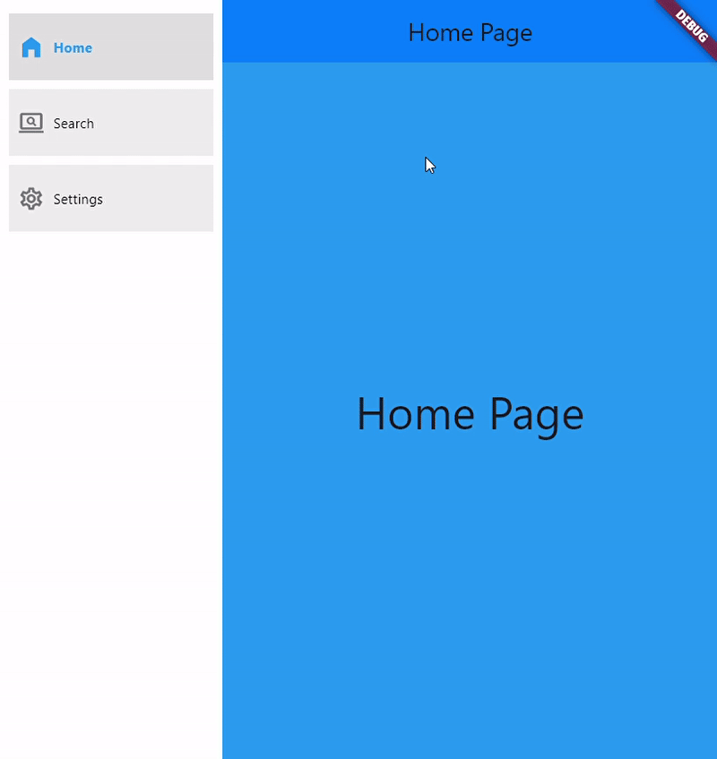
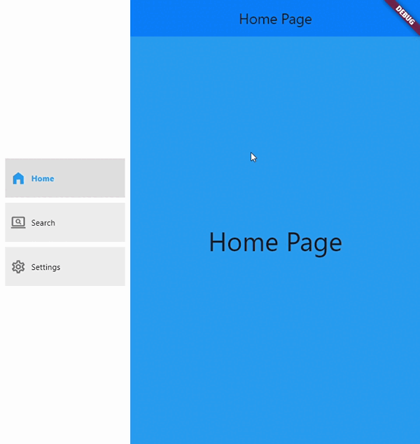

<!--
This README describes the package. If you publish this package to pub.dev,
this README's contents appear on the landing page for your package.

For information about how to write a good package README, see the guide for
[writing package pages](https://dart.dev/guides/libraries/writing-package-pages).

For general information about developing packages, see the Dart guide for
[creating packages](https://dart.dev/guides/libraries/create-library-packages)
and the Flutter guide for
[developing packages and plugins](https://flutter.dev/developing-packages).
-->

Navigation SideBar is Fully Customizable Navigator Widget.

## Features





## Getting started

Add the Package in your pubspec.yaml file.
import the package.
Then Write NavigationSideBar and in items use NavigationSideBarItem.

## Usage


```dart

Scaffold(
  body: Row(
    children: [
      NavigationSideBar(
        isExtended: _isExtended,
        isIndicatorActive: true,
        items: [
          NavigationSideBarItem(
            selectedIcon: Icons.home_filled,
            unSelectedIcon: Icons.home_outlined,
            text: 'Home'),
          NavigationSideBarItem(
            selectedIcon: Icons.screen_search_desktop_rounded,
            unSelectedIcon: Icons.screen_search_desktop_outlined,
            text: 'Search'),
          NavigationSideBarItem(
            selectedIcon: Icons.settings_rounded,
            unSelectedIcon: Icons.settings_outlined,
            text: 'Settings'),
        ],
        initialSelectedIndex: _selectedIndex,
        onItemSelected: (int value) {
          setState(() {
            _selectedIndex = value;
            });
          },
        ),
        Expanded(child: list[_selectedIndex]),
        ],
      ),
    );
```

## Additional information

    import 'package:flutter/material.dart';
    import 'package:navigation_sidebar.dart';
    import 'package:navigation_sidebar_theme.dart';

    void main() {
      runApp(const MyApp());
    }

    class MyApp extends StatefulWidget {
    const MyApp({super.key});

    @override
    State<MyApp> createState() => _MyAppState();
    }

    class _MyAppState extends State<MyApp> {
    int _selectedIndex = 0;

    @override
    Widget build(BuildContext context) {
    return MaterialApp(
    home: NavigationSideBar(
    items: [
    Page1(),
    Page2(),
    Page3(),
    ],
    onItemSelected: (int index) {
    setState(() {
    _selectedIndex = index;
    });
    },
    initialSelectedIndex: _selectedIndex,
    isExtended: true, isIndicatorActive: true,

        animationDuration: Duration(milliseconds: 500),
        bottomWidget2: Add bottom widget here ,
        bottomWidget:  Add bottom widget here,
        topWidget2: Add top widget here,
        topWidget: Add top widget here,
        collapsedWidth: 60,
        extendedWidth: 200,
        showExtendedButton: true,

        theme: NavigationSideBarTheme(
          backgroundColor: Colors.white,
          elevation: 10,
          selectedIconColor: Colors.blue,
          selectedTextStyle: TextStyle(
              color: Colors.blue, fontSize: 20, fontWeight: FontWeight.bold),
          unSelectedIconColor: Colors.black,
          unSelectedTextStyle: TextStyle(
              color: Colors.black, fontSize: 20, fontWeight: FontWeight.bold),
        ),
       ),
      );
     }
    }
